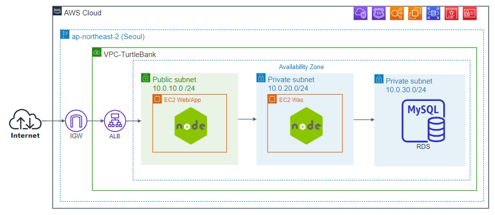
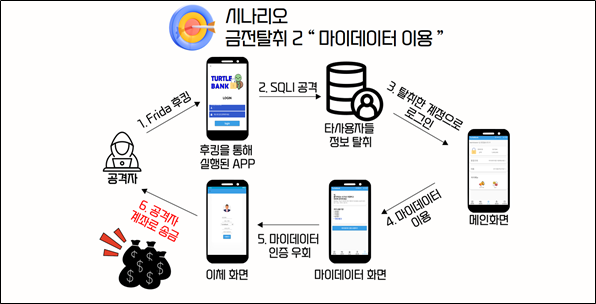
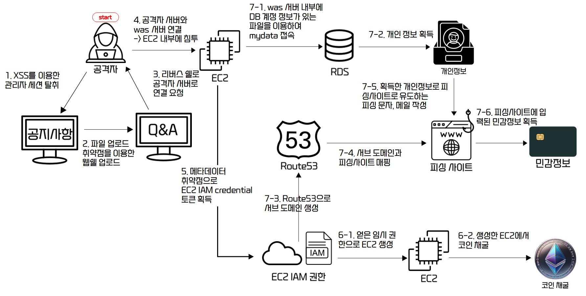

# TurtleBank

**SK 루키즈 18기 모의 해킹**  
프로젝트 기간  : 24-06-22 ~ 24-08-08

팀 멤버

- **팀장**: [라현근] (https://github.com/radir429)
- [구한을] (https://github.com/han-eul) 
- [김도현 1] (https://github.com/ehgus0117)
- [김도현 2] (https://github.com/chichimon12)
- [김태윤] (https://github.com/kty2541)
- [박찬웅] (https://github.com/chanwoong)
- [윤수용] (https://github.com/YSY986)
- [이민선] (https://github.com/minseon)
- [이지민] (https://github.com/Jiiiiimin)
- [조민성] (https://github.com/casablanca44)

AWS 클라우드 구성도

  

취약점

  
### 진단기준
 - 2024 핀테크서비스 취약점 점검 안내(오픈뱅킹)     
 - https://fintech.fsec.or.kr/
  
### WAB (웹 애플리케이션)
- 중요한 정보를 평문으로 전송
- 입력 정보 보호 조치 적용
- 계정 정보 무결성 검증
- 금액 한도 검증
- 거래 정보 재사용
- 리다이렉트 기능을 이용한 피싱 가능성
- SQL 인젝션
- 서버 운영 정보 노출
- 크로스 사이트 스크립팅 (XSS)
- 크로스 사이트 요청 위조 (CSRF)
- 파일 업로드 취약점
- 파일 다운로드 취약점
- 사용자 인증 정보 재사용
- 세션 정보 재사용
- 비밀번호 복잡성 검증 수준
- 비밀번호 오류 횟수 제한

### APP (모바일 애플리케이션)
- 메모리 내 중요한 정보 평문 노출
- 중요한 정보를 평문으로 전송
- 약한 HTTPS 정책 사용
- 디버그 로그에 중요한 정보 평문 노출
- 입력 정보 보호 조치 적용
- 계정 정보 무결성 검증
- 금액 정보 무결성 검증
- 금액 한도 검증
- 거래 정보 재사용
- 앱 위조 탐지 기능 적용
- 해킹 OS 탐지 기능 적용
- 안티 디버깅 적용
- (안드로이드) 코드 난독화
- (안드로이드) 안티바이러스
- SQL 인젝션
- 파일 업로드 취약점
- 사용자 인증 정보 재사용
- 세션 만료 부족
- 비밀번호 복잡성 검증 수준
- 비밀번호 오류 횟수 제한
- 강제 화면 실행
- 계좌 소유자 검증

시나리오

### 시나리오 1  
  

**악성 프로그램 및 변경된 앱 배포를 통한 금전 탈취**
- **수수료 송금 로직이 변경된 앱 배포**:
  - QR 송금 기능의 수수료 송금 계좌 번호가 하드 코딩되어 있어, 공격자는 이를 자신의 계좌 번호로 변경한 앱을 배포합니다.
  - 사용자 입장에서는 정상적인 거래가 이루어진 것으로 보이기 때문에 공격을 인지하지 못합니다.
  - 은행 관리자가 이를 인식할 때까지 지속적인 수수료 탈취가 가능합니다.

- **키보드 보안 프로그램으로 위장한 RAT 파일**:
  - 사용자가 보안 프로그램으로 위장한 RAT 파일을 설치하고, 공격자는 원격으로 사용자의 PC에 접근하여 키로깅, 웹캠 도청, 민감 정보 접근, 랜섬웨어 바이러스 감염 등 다양한 공격을 통해 금전을 탈취합니다.

### 시나리오 2  
  

**마이 데이터를 이용하여 다른 은행에서 금전 탈취**
- 자동 스크립트를 이용하여 다른 은행과 거래하는 모든 계좌의 자금을 공격자의 계좌로 이체합니다.

### 시나리오 3  
  

**메타데이터 취약점을 이용한 AWS 공격**
- **메타데이터 취약점을 이용한 EC2 생성 및 코인 채굴**:
  - 공격자는 EC2에 부여된 IAM 권한을 획득하여 피해자의 AWS에 EC2를 생성할 수 있습니다.
  - 공격자는 무작위로 생성된 EC2에 코인 채굴 프로그램을 설치하여 금전적 이익을 얻고, 동시에 AWS 사용자에게 많은 요금을 청구합니다.
  - 공격자의 서버를 AWS 서버에 역셸을 통해 연결하고, AWS 서버 내부의 DB 계정 정보를 이용하여 RDS에 접근하여 회원의 개인 정보를 획득합니다.
  - 외부에서 접근할 수 없는 EC2에 업로드된 웹셸을 이용하여 공격자의 서버에 역셸을 통해 연결하고, EC2 내부에 접근합니다.
  - 연결된 EC2 내에서 RDS에 접근할 수 있는 계정 정보를 찾아 이를 이용해 MySQL에 접근하여 회원의 개인 정보를 획득합니다.
  - 획득한 개인 정보를 이용해 피싱 이메일과 문자를 보내고, 피싱 사이트로 유도하여 회원의 민감 정보를 획득할 수 있습니다.
  - 획득한 전화번호와 이메일 주소를 이용해 피싱 문자와 이메일을 보내어 회원을 피싱 사이트로 유도하여 민감 정보(카드 번호, 주민등록번호 등)를 획득할 수 있습니다.

오픈 소스 출처

- [Damn-Vulnerable-Bank (V1)](https://github.com/rewanthtammana/Damn-Vulnerable-Bank)
- [OhBank Online (V2)](https://ohbank.online/)
- [ShieldBank (V3)](https://github.com/BreakTheShield/ShieldBank)

